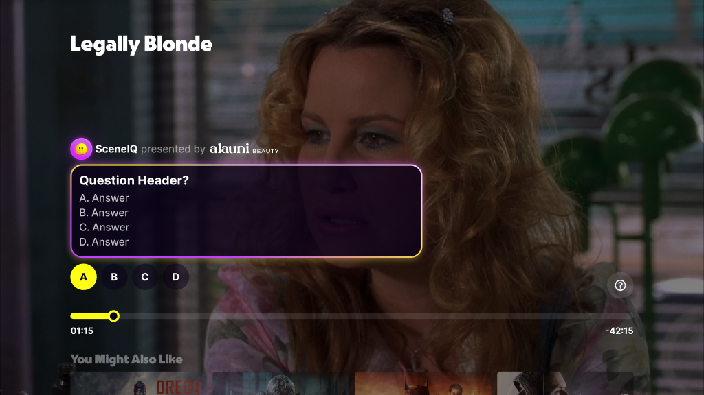
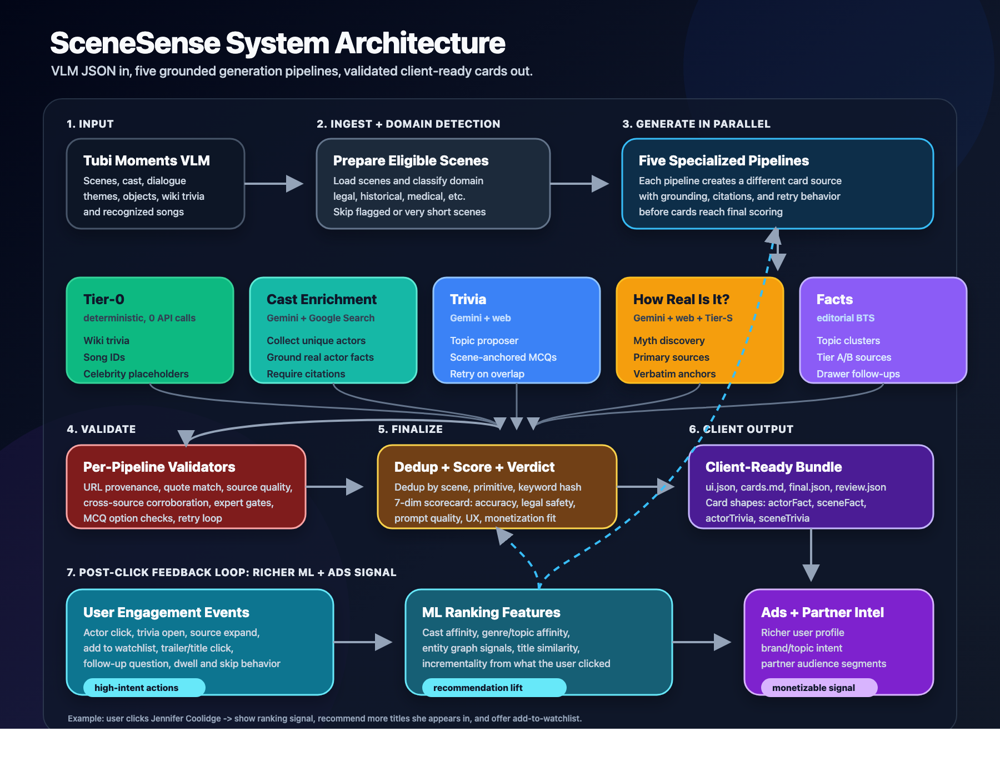

# scene-sense

> **SceneSense / SceneIQ** — a CTV scene-aware engagement layer.
> VLM scene JSON in → validated, client-ready pause-screen prompts out.

Scene-anchored trivia, myth-busting legal/historical checks, cast facts, and
editorial context — delivered at the right on-screen moment, with source
provenance, cross-source corroboration, and an HITL review surface.



---

## What's in the box

Five generation pipelines, a trust layer, and a player-facing card contract.

| Pipeline | What it does | Grounding |
|---|---|---|
| **Tier-0** | Deterministic wiki-matched trivia, song IDs, cast hits | 0 API calls — reads the VLM JSON |
| **Cast enrichment** | Grounded actor career facts + title-aware quotes | Gemini + Google Search |
| **Trivia** | Scene-anchored MCQs with retry + cross-source corroboration | Gemini + web |
| **How Real Is It? v2** | Myth-busting prompts for legal / historical / medical scenes | Gemini + Tier-S primary sources |
| **Facts (BTS)** | Editorial behind-the-scenes prompts with drawer follow-ups | Gemini + topic-clustered web |

Every pipeline emits records that flow through **validation** (URL provenance,
verbatim quote match, cross-source corroboration, expert gates), **finalize**
(dedup, 7-dim scoring, verdict), and emerge as the **player-facing card
contract**:

- `sceneHRIT` — How Real Is It? card
- `sceneTrivia` — MCQ with one correct answer
- `sceneFact` — editorial or wiki-matched fact
- `actorFact` — grounded actor card (chainable with `nextFollowUps`)



---

## 60-second demo (no API keys needed)

The Legally Blonde demo bundle ships inside the package. Hand-curated, cue
points manually verified against the film, tone aligned with the reviewer
spec.

```bash
git clone <this-repo>
cd scene-sense
python3 -m venv .venv && source .venv/bin/activate
pip install -e .

scene-sense demo                          # writes 3 files to data/outputs/
scene-sense validate data/outputs/legally_blonde.demo.json
```

You'll get:

```
data/outputs/legally_blonde.demo.json         # 6 cards, schema-valid, playback order
data/outputs/legally_blonde.demo.md           # spec + content per card
data/outputs/legally_blonde.ux_walkthrough.md # exact viewer-facing UX flow
```

### Demo card summary

| # | Type | Scene | Cue | Prompt |
|---|---|---|---|---|
| 1 | sceneFact   | 1  | 00:01:33 – 00:02:03 | Elle Woods almost wasn't Reese |
| 2 | sceneTrivia | 2  | 00:03:20 – 00:03:37 | What's Bruiser's real name? |
| 3 | sceneTrivia | 7  | 00:10:23 – 00:10:43 | What's Warner's breakup ride? |
| 4 | actorFact   | 25 | 00:32:15 – 00:32:45 | Recognize her? |
| 5 | sceneHRIT   | 38 | 00:46:46 – 00:47:16 | Fact Check: Habeas Corpus? |
| 6 | sceneHRIT   | 67 | 01:21:35 – 01:22:05 | Fact Check: Elle takes over? |

---

## Install

Requires Python 3.10+.

```bash
pip install -e .                  # core + demo only (no LLM deps)
pip install -e ".[llm]"           # + Gemini / OpenAI / youtube-transcript-api
pip install -e ".[databricks]"    # + Databricks SQL connector
pip install -e ".[dev]"           # + pytest, ruff
```

Environment: copy `.env.example` → `.env` and fill in `GEMINI_API_KEY` for
anything beyond `scene-sense demo` / `scene-sense validate`.

---

## CLI

One unified entry point, `scene-sense`. Every pipeline is a subcommand.

```bash
scene-sense --help
scene-sense version

# Zero-API demo & validation
scene-sense demo                                    # write curated LB bundle
scene-sense validate data/outputs/legally_blonde.demo.json

# Per-pipeline (require GEMINI_API_KEY unless noted)
scene-sense tier0   data/samples/Legally_Blonde.json            # no API
scene-sense trivia  data/samples/Legally_Blonde.json --limit 5
scene-sense hriv2   data/samples/Legally_Blonde.json --domain legal --limit 5
scene-sense facts   data/samples/Legally_Blonde.json --topics 6
scene-sense cast    data/samples/Legally_Blonde.json --max-actors 10

# Consolidation
scene-sense finalize --title "Legally Blonde" \
  --moments data/samples/Legally_Blonde.json \
  --outputs data/outputs/legally_blonde.tier0.json \
  --outputs data/outputs/legally_blonde.trivia.json

# End-to-end
scene-sense run-all data/samples/Legally_Blonde.json --trivia-scenes 8
```

### `scene-sense validate`

Pure-Python schema check. No network, no API keys. Verifies:

- top-level `title` + `cards[]` present
- each card is one of `{sceneHRIT, sceneTrivia, sceneFact, actorFact}`
- each card has a `sceneCuepoint` with `startTime` / `endTime`
- required fields present for the card's type
- `sceneTrivia` has exactly one correct option
- cards are sorted in playback order (warning if not)

Exits 0 on pass, 1 on any failure.

---

## Repo layout

```
scene-sense/
├─ src/scene_sense/
│  ├─ cli/                    # Unified `scene-sense` CLI
│  ├─ demo/                   # Packaged hand-curated demo bundles
│  ├─ tier0/                  # Deterministic VLM-JSON → prompts
│  ├─ trivia/                 # Scene-anchored MCQ pipeline
│  ├─ realism_v2/             # How Real Is It? myth-bust pipeline
│  ├─ facts/                  # Editorial BTS pipeline
│  ├─ cast_enrichment/        # Grounded actor-fact pipeline
│  ├─ realism/                # Legacy v1 realism + shared config/gemini client
│  ├─ fame/                   # Wikipedia-based subject fame gate
│  ├─ curiosity_judge/        # LLM-as-viewer scoring
│  ├─ ui_schema/              # Contract + emitter for client card types
│  └─ eval/                   # Finalize, scorer, eval harness
├─ scripts/                   # Back-compat wrappers (prefer the CLI)
├─ data/
│  ├─ samples/                # VLM JSON fixtures (Legally_Blonde, Gladiator, …)
│  ├─ outputs/                # Pipeline outputs (mostly gitignored, demo.json kept)
│  └─ eval/                   # Gold-set annotations
├─ docs/
│  ├─ prds/                   # Product specs (master, content-intel, client UX, monetization)
│  ├─ vision/                 # TubiX exec summary + platform walkthroughs
│  ├─ schema/                 # Tubi Moments + prompt-output schemas
│  ├─ use-cases/              # UX primitive catalogue + architecture references
│  ├─ research/               # LB demo spec + UX walkthrough + legal/eval notes
│  ├─ archive/                # Superseded drafts kept for reference
│  ├─ meeting-notes/          # Planning + hackathon session captures
│  └─ assets/                 # README imagery (architecture diagrams, pause-screen mocks)
├─ tests/                     # Smoke tests (no API keys required)
├─ pyproject.toml             # Packaging + CLI entry point
├─ requirements.txt           # Pinned dep set for non-editable installs
├─ CHANGELOG.md
├─ CONTRIBUTING.md
└─ README.md                  # (this file)
```

---

## How a card gets made

```
┌───────────┐       ┌──────────────┐       ┌────────────┐       ┌──────────────┐
│ Tubi VLM  │─────▶│ 5 generation │─────▶│ Trust layer│─────▶│ UI bundle +  │
│ scene JSON│       │ pipelines    │       │ (validate, │       │ review.json  │
└───────────┘       │ (parallel)   │       │  dedup,    │       │ (player +    │
                    └──────────────┘       │  score)    │       │  HITL)       │
                                            └────────────┘       └──────────────┘
```

1. **Input.** Tubi Moments VLM JSON — scenes, cast detections, dialogue,
   objects, themes, songs, wiki-matched trivia.
2. **Eligibility + domain detection.** Classify each scene as legal / historical /
   medical / sports / military / rom-com, skip non-content scenes and very
   short beats.
3. **Generate in parallel.** Tier-0 + Cast + Trivia + HRIT + Facts. Each
   pipeline is independent and emits records with identical envelopes
   (`prompt_id`, `scene_index`, `generated_by`, `sources[]`, …).
4. **Per-pipeline validators.** URL provenance, verbatim quote match against
   the cited page, cross-source corroboration, source quality tiering, expert
   gates, MCQ option-integrity checks, retry on overlap.
5. **Finalize.** Dedup across pipelines by `(scene, primitive, semantic-key)`;
   7-dim scorecard (accuracy, legal safety, prompt quality, UX, monetization
   fit, source quality, specificity); emit verdict (approve / reject /
   needs-edit).
6. **Emit.** Route records through the UI schema to their card type and write
   the `.ui.json` client bundle plus a `.review.json` HITL surface.

See [`docs/use-cases/architecture-overview.md`](docs/use-cases/architecture-overview.md)
for the expanded version with per-component notes.

---

## Sample card shapes

### sceneHRIT

```json
{
  "type": "sceneHRIT",
  "sceneCuepoint": { "sceneIndex": 38, "startTime": "00:46:46.000", "endTime": "00:47:16.000" },
  "proactivePrompt": "Fact Check: Habeas Corpus?",
  "title": "Could Elle really use habeas corpus to get the dog back?",
  "question": "Could Elle really use habeas corpus to get the dog back?",
  "answer": "Pure Hollywood bluff. Habeas corpus is a writ to produce a detained person before a court — it has nothing to do with pets. The correct legal action for recovering a dog is a writ of replevin.",
  "followUps": [
    { "question": "Would her bluff actually work?", "answer": "The tactic is real…" },
    { "question": "What's a writ of replevin?", "answer": "The actual legal tool Elle should have named…" }
  ]
}
```

### sceneTrivia

```json
{
  "type": "sceneTrivia",
  "sceneCuepoint": { "sceneIndex": 2, "startTime": "00:03:20.000", "endTime": "00:03:37.000" },
  "proactivePrompt": "What's Bruiser's real name?",
  "triviaText": "What was the name of the dog actor who played Bruiser?",
  "triviaOptions": [
    { "id": 0, "isCorrect": true,  "triviaOptionText": "Moonie" },
    { "id": 1, "isCorrect": false, "triviaOptionText": "Buddy" },
    { "id": 2, "isCorrect": false, "triviaOptionText": "Max" },
    { "id": 3, "isCorrect": false, "triviaOptionText": "Rocky" }
  ],
  "answerText": "Moonie was a rescue Chihuahua adopted by trainer Sue Chipperton. He lived to be 18.",
  "followUps": [ … ]
}
```

### actorFact (chained with nextFollowUps)

```json
{
  "type": "actorFact",
  "proactivePrompt": "Recognize her?",
  "actorName": "Jennifer Coolidge",
  "character": "Paulette",
  "factText": "…",
  "followUps": [
    {
      "question": "Her first Emmy win",
      "answer": "The White Lotus (2022)…",
      "nextFollowUps": [
        { "question": "See her upcoming projects", "answer": "…",
          "nextFollowUps": [ … ] },
        { "question": "Send this to my phone", "answer": "…",
          "sendToPhone": { "label": "…", "enabled": true } }
      ]
    }
  ]
}
```

---

## Testing

```bash
pip install -e ".[dev]"
pytest
```

The smoke tests run without API keys — they validate the demo bundle, the
packaged demo loader, and the UI schema contract. Add pipeline-level tests
behind a `GEMINI_API_KEY` fixture when you need coverage for live generation.

---

## Positioning

SceneSense / SceneIQ is a **CTV-first extension of Interactive Pause** — scene-aware
premium direct-sold ad formats *and* real in-player interaction value for
viewers. Mobile, web, proactive playback prompts, dual-screen handoff, and
conversational AI are Phase 2+.

This repo is a **spec + prototyping workspace** — not the production client /
ad codebase. Final implementation lands in Tubi product repos.

---

## Status & roadmap

- **v0.1.0 (current).** Hand-curated Legally Blonde demo bundle, 5 generation
  pipelines, trust layer, UI schema contract, `scene-sense` CLI, smoke tests,
  dry-run reproducibility.
- **Next.** Title-agnostic parity runs on Gladiator + The Devil's Advocate,
  tighter Lia gold-set agreement, Figma-design handoff, client bundle versioning.

See [`CHANGELOG.md`](CHANGELOG.md) for version history and
[`CONTRIBUTING.md`](CONTRIBUTING.md) for how to add a new pipeline or card
type.
