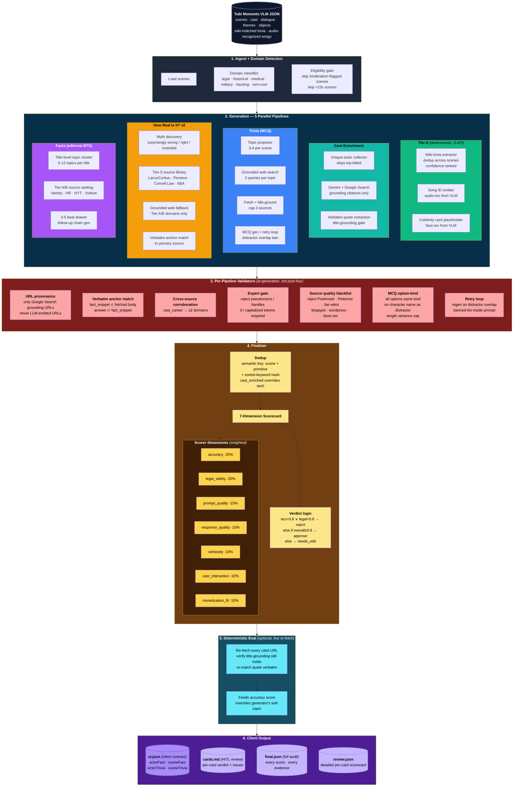

# SceneSense — System Architecture

---

## How it works (6 layers)

**1 · Ingest + Domain Detection** — Load the VLM JSON, classify primary domain (legal / historical / medical / etc.), gate scenes by duration and moderation severity.

**2 · Generation** — 5 parallel pipelines, each with its own sub-stages:
- **Tier-0** — wiki trivia, songs, celebrity cards from what the VLM already produced. Zero API calls.
- **Cast Enrichment** — unique-actor collection, Google Search grounding, verbatim quote extraction.
- **Trivia** — topic proposer → grounded search → fetch + filter → MCQ generation with retry loop.
- **How Real Is It? v2** — myth discovery → Tier-S curated primary sources (LacusCurtius, Perseus, Cornell Law, ABA) → verbatim anchor match.
- **Facts** — title-level topic clustering → Tier A/B ranked search → 3-5 beat drawer + follow-up chains.

**3 · Per-Pipeline Validators** — 7 hard gates at generation time (not post-hoc):
- URL provenance (never LLM-emitted)
- Verbatim anchor match (quote/fact in live body)
- Cross-source corroboration (cast_career needs 2 domains)
- Expert gate (reject pseudonyms)
- Source quality blacklist (Poshmark, Pinterest, blogspot, facts.net)
- MCQ option-kind (character name can't be distractor; length parity; same kind)
- Retry loop (regen on distractor overlap with banned-list in prompt)

**4 · Finalizer** — semantic dedup across primitives (cast_enriched beats Tier-0 placeholder), 7-dimension weighted scorecard (accuracy 25 · legal 20 · prompt_quality 15 · response_quality 10 · verbosity 10 · UX 10 · monetization 10), verdict logic: `accuracy<0.8 ∨ legal<0.8 → reject; overall≥0.8 → approve; else needs_edit`.

**5 · Deterministic Eval** *(optional)* — re-fetches every cited URL at finalize time, re-matches the quote verbatim, overrides the generator's self-claim. Catches cases where a source went 404 or a quote drifted.

**6 · Client Output** — four files:
- `ui.json` — client contract: `actorFact · sceneFact · actorTrivia · sceneTrivia`
- `cards.md` — human HITL review
- `final.json` — full audit (every score, every evidence)
- `review.json` — detailed per-card scorecard

## Example outputs (Gladiator demo)

| Card shape | Source | Example |
|---|---|---|
| **sceneFact** | How Real Is It? | *"Gladiator invented 'Strength and honor' motto"* — cites **Petronius, Satyricon 117** via Perseus Digital Library |
| **sceneFact** | Facts | *"Russell Crowe's Real-Life Battle Scars"* — disintegrating hip, torn Achilles, missing toe cartilage |
| **sceneTrivia** | Trivia | *"Where was the wheat field filmed?"* → **3 km south of Pienza, Terrapille road** |
| **actorTrivia** | Trivia (cast_career) | *"Before Commodus, which film did Joaquin Phoenix star in?"* → **8mm (1999)** |
| **actorFact** | Cast Enrichment | *"Joaquin Phoenix — breakthrough as Commodus earned an Oscar nomination"* |
