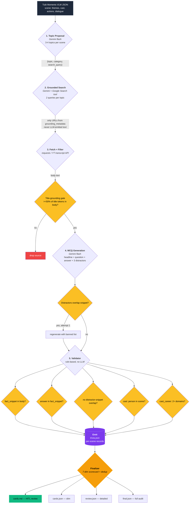
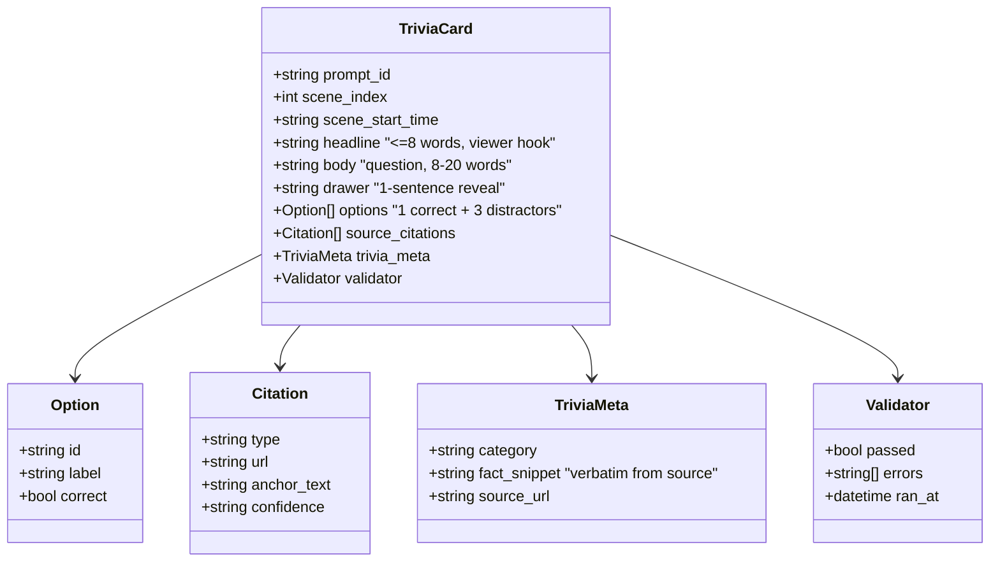
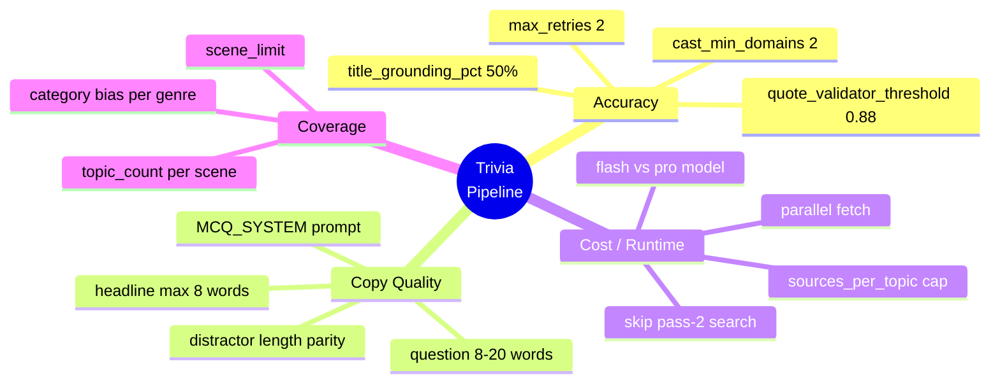
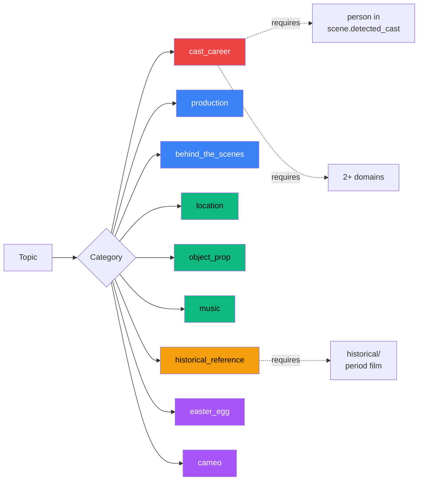
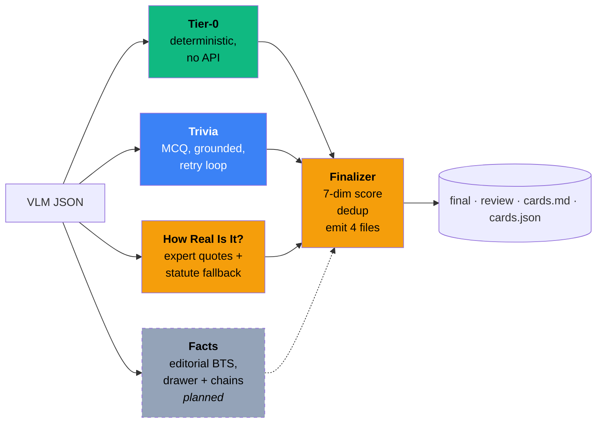

# Trivia Pipeline — Architecture

---

## Emit schema

---

## Tuning dials

---

## Category taxonomy

Red = has accuracy gates · Amber = genre-gated · Green = low-risk · Purple = discovery-heavy

---

## Sibling pipelines

